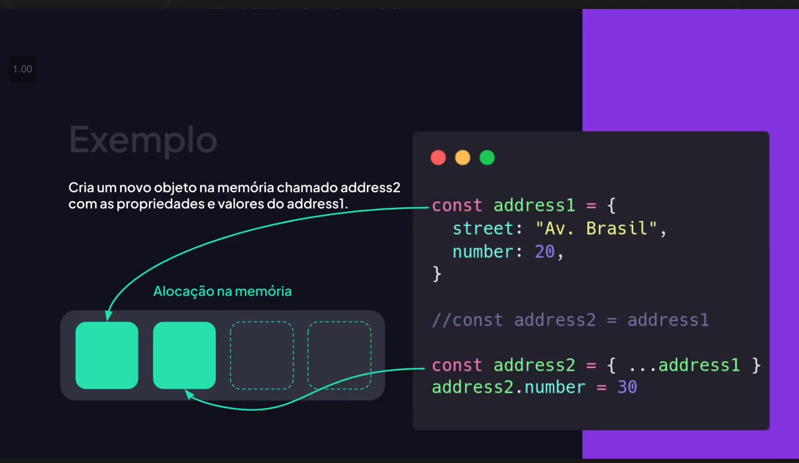

# 1 - Conceitos de Imutabilidade

## O que e imutabilidade

Imutabilidade significa **nao alterar** um dado existente. Em vez de mudar um valor ou objeto original, voce **cria uma nova versao** com as mudancas. Isso torna o codigo mais previsivel e facil de testar.

## Por que imutabilidade importa

- **Previsibilidade**: evita efeitos colaterais inesperados.
- **Debug mais facil**: o estado antigo continua disponivel.
- **Seguranca**: reduz bugs por alteracoes acidentais.
- **Compatibilidade com React/Redux**: muitos frameworks dependem disso.

### Na criacao de interfaces (UI)

A imutabilidade ajuda a **otimizar atualizacoes de interface** (DOM/UI) porque fica mais simples detectar mudancas entre o estado antigo e o novo. Isso torna o fluxo de renderizacao mais previsivel e eficiente.

### Detectar mudancas

Em objetos mutados, fica mais dificil saber **o que mudou**, porque o mesmo objeto foi alterado. Em dados imutaveis, a comparacao fica mais simples: se a referencia mudou, o estado mudou. Isso facilita identificar alteracoes e atualizar apenas o necessario.

### Beneficio na renderizacao

Como os dados imutaveis permitem detectar mudancas com facilidade, fica mais simples decidir **quando** um componente deve ser renderizado novamente. Isso ajuda a atualizar apenas o que mudou na tela, economizando processamento.

## Principios e valores da imutabilidade

- **Nao mutar o original**: sempre gerar uma nova versao dos dados.
- **Transparencia de estado**: o estado anterior continua acessivel.
- **Funcoes puras**: mesma entrada gera a mesma saida.
- **Isolamento de mudancas**: alterar um ponto nao afeta outros trechos.
- **Previsibilidade e confianca**: facilita raciocinio e testes.

## Mutacao vs imutabilidade

### Mutacao (altera o original)

```javascript
const lista = ["a", "b", "c"];
lista.push("d");

console.log(lista); // ["a", "b", "c", "d"]
```

### Imutabilidade (cria novo)

```javascript
const lista = ["a", "b", "c"];
const novaLista = [...lista, "d"];

console.log(lista); // ["a", "b", "c"]
console.log(novaLista); // ["a", "b", "c", "d"]
```

## Imutabilidade em arrays

### Adicionar item

```javascript
const numeros = [1, 2, 3];
const novo = [...numeros, 4];
```

### Remover item

```javascript
const numeros = [1, 2, 3, 4];
const semDois = numeros.filter((n) => n !== 2);
```

### Atualizar item

```javascript
const numeros = [1, 2, 3];
const atualizados = numeros.map((n) => (n === 2 ? 20 : n));
```

## Imutabilidade em objetos

### Adicionar ou alterar propriedade

```javascript
const usuario = { nome: "Ana", idade: 28 };
const atualizado = { ...usuario, idade: 29 };
```

### Remover propriedade

```javascript
const usuario = { nome: "Ana", idade: 28, cidade: "SP" };
const { cidade, ...semCidade } = usuario;
```

## Imutabilidade e referencias

Mesmo usando spread, a copia e **rasa** (shallow). Objetos internos continuam apontando para a mesma referencia:

```javascript
const original = { perfil: { nome: "Ana" } };
const copia = { ...original };

copia.perfil.nome = "Bia";
console.log(original.perfil.nome); // Bia
```

Para garantir imutabilidade profunda, voce precisa copiar os niveis internos:

```javascript
const original = { perfil: { nome: "Ana" } };
const copia = { ...original, perfil: { ...original.perfil, nome: "Bia" } };
```

## Pegadinha comum: copia por referencia

Quando voce faz `obj2 = obj1`, **nao** cria uma copia. Os dois apontam para o **mesmo** objeto na memoria. Qualquer alteracao em um afeta o outro.



```javascript
const address1 = {
  street: "Av. Brasil",
  number: 20,
};

const address2 = address1; // referencia, nao copia
address2.number = 30;

console.log(address1.number); // 30
```

Para evitar isso, crie uma copia:

```javascript
const address1 = {
  street: "Av. Brasil",
  number: 20,
};

const address2 = { ...address1 };
address2.number = 30;

console.log(address1.number); // 20
console.log(address2.number); // 30
```

## Referencia vs objeto separado (na pratica)

Da para perceber a diferenca entre **referencia** e **novo objeto** com esses exemplos:

### Objeto: referencia (errado para imutabilidade)

```javascript
const address1 = {
  street: "Av. Brasil",
  number: 20,
};

const address2 = address1; // referencia
address2.number = 30;

console.log(address1.number); // 30
console.log(address2.number); // 30
```

### Objeto: copia separada (correto)

```javascript
const address1 = {
  street: "Av. Brasil",
  number: 20,
};

const address2 = { ...address1, number: 30 };

console.log(address1.number); // 20
console.log(address2.number); // 30
```

### Array: referencia (errado para imutabilidade)

```javascript
const list1 = ["Apple", "Banana"];
const list2 = list1; // referencia

list2.push("Watermelon");

console.log(list1); // ["Apple", "Banana", "Watermelon"]
console.log(list2); // ["Apple", "Banana", "Watermelon"]
```

### Array: copia separada (correto)

```javascript
const list1 = ["Apple", "Banana"];
const list2 = [...list1, "Watermelon"];

console.log(list1); // ["Apple", "Banana"]
console.log(list2); // ["Apple", "Banana", "Watermelon"]
```

## Metodos que mutam vs nao mutam

### Mutam o array

- `push`, `pop`, `shift`, `unshift`
- `sort`, `reverse`, `splice`

### Nao mutam o array

- `map`, `filter`, `reduce`
- `slice`, `concat`

## Exemplos praticos do dia a dia

### 1) Atualizar item no carrinho

```javascript
const carrinho = [
  { id: 1, nome: "Mouse", qtd: 1 },
  { id: 2, nome: "Teclado", qtd: 1 },
];

const atualizado = carrinho.map((item) =>
  item.id === 2 ? { ...item, qtd: item.qtd + 1 } : item
);
```

### 2) Remover usuario por id

```javascript
const usuarios = [
  { id: 1, nome: "Ana" },
  { id: 2, nome: "Bia" },
];

const semBia = usuarios.filter((u) => u.id !== 2);
```

### 3) Adicionar configuracao sem mutar

```javascript
const config = { tema: "claro" };
const novaConfig = { ...config, idioma: "pt-BR" };
```

## Cuidados e boas praticas

- Sempre verifique se o metodo que voce usa muta ou nao.
- Para objetos profundos, copie os niveis internos necessarios.
- Prefira funcoes puras (mesma entrada, mesma saida).
- Documente quando a funcao altera o estado.

## Resumo

Imutabilidade significa criar novas versoes dos dados em vez de alterar os originais. Isso melhora previsibilidade, reduz bugs e facilita manutencao.

## Exercicios avancados (com respostas)

### 1) Atualizar idade sem mutar

**Enunciado:** Atualize a idade de `id = 2` para `30`.

**Resposta:**

```javascript
const pessoas = [
  { id: 1, idade: 20 },
  { id: 2, idade: 25 },
];

const atualizadas = pessoas.map((p) => (p.id === 2 ? { ...p, idade: 30 } : p));
```

### 2) Remover item por nome

**Enunciado:** Remova `"banana"` do array.

**Resposta:**

```javascript
const frutas = ["maca", "banana", "uva"];
const semBanana = frutas.filter((f) => f !== "banana");
```

### 3) Adicionar propriedade em objeto

**Enunciado:** Adicione `status: "ativo"` sem mutar o original.

**Resposta:**

```javascript
const usuario = { nome: "Ana" };
const novo = { ...usuario, status: "ativo" };
```

## Resumo final em tabela

| Situacao         | Exemplo                    | Observacao      |
| ---------------- | -------------------------- | --------------- |
| Adicionar item   | `[...arr, novo]`           | Nao muta        |
| Remover item     | `arr.filter(...)`          | Cria novo array |
| Atualizar item   | `arr.map(...)`             | Cria novo array |
| Atualizar objeto | `{ ...obj, chave: valor }` | Copia rasa      |
