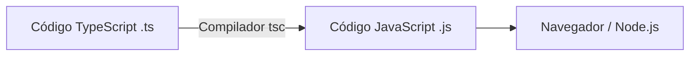

# Introdução ao TypeScript

Bem-vindo à sua aula inicial sobre **TypeScript**! Nesta aula, vamos entender o que é o TypeScript, por que ele se tornou um padrão de mercado no desenvolvimento moderno e quais são as suas principais vantagens em relação ao JavaScript puro.

---

## O que é o TypeScript?

O **TypeScript** é uma linguagem de programação de código aberto desenvolvida e mantida pela Microsoft. Ela é descrita como um **superset** (ou superconjunto) de JavaScript. 

> [!NOTE]
> **O que significa ser um "superset"?**
> Significa que todo código JavaScript válido também é um código TypeScript válido. O TypeScript adiciona recursos adicionais (principalmente tipagem estática e recursos modernos do ECMAScript) sobre a base do JavaScript.

Como os navegadores e ambientes de execução (como Node.js) não conseguem executar o TypeScript diretamente, o código escrito em TypeScript é compilado (ou transpilado) para JavaScript puro antes de ser executado.



---

## TypeScript vs JavaScript Puro: As Diferenças Fundamentais

A grande diferença entre as duas linguagens está na forma como lidam com os **tipos** de dados (como strings, números, objetos, etc.).

| Característica | JavaScript | TypeScript |
| :--- | :--- | :--- |
| **Tipagem** | Dinâmica (os tipos são descobertos em tempo de execução) | Estática (os tipos são definidos e validados em tempo de compilação) |
| **Erros de Tipo** | Descobertos apenas quando o usuário executa o código (Runtime) | Identificados pelo editor/compilador antes de executar (Compile-time) |
| **Ferramental** | Autocomplete limitado e propenso a falhas | Autocomplete extremamente preciso e rico (IntelliSense) |
| **Escalabilidade** | Difícil de manter em bases de código gigantes | Excelente para grandes equipes e projetos de larga escala |

---

## Principais Vantagens do TypeScript

### 1. Segurança de Tipos (Type Safety)
No JavaScript, você pode facilmente passar uma `string` para uma função que espera um `number`, o que pode causar comportamentos inesperados ou travamentos no sistema (o famoso `Cannot read property 'undefined'`). O TypeScript impede isso acusando o erro imediatamente no seu editor de código.

### 2. Autocomplete e Produtividade (Developer Experience)
Com os tipos definidos, o editor (como o VS Code) sabe exatamente quais propriedades e métodos estão disponíveis em qualquer objeto ou variável. Isso reduz a necessidade de consultar a documentação a todo momento e acelera muito a escrita de código.

### 3. Refatoração Segura
Se você precisar alterar o nome de uma propriedade em um objeto que é usado em centenas de arquivos, fazer isso em JavaScript puro pode ser assustador. No TypeScript, você pode usar a função de renomear e o compilador atualizará todas as referências com segurança. Se esquecer de atualizar alguma parte, o compilador acusará um erro na hora.

### 4. Código Auto-documentado
Os tipos funcionam como uma documentação viva e sempre atualizada do seu código. Ao ler a assinatura de uma função, você sabe instantaneamente o que ela recebe e o que ela retorna.

---

## Exemplo Prático: JavaScript vs TypeScript

Vamos comparar como as duas linguagens lidam com um erro simples de desenvolvimento.

### Em JavaScript Puro
Imagine que você tem uma função para calcular o preço total:

```javascript
function calcularTotal(preco, taxa) {
  return preco + (preco * taxa);
}

// O desenvolvedor comete um erro e passa uma string para a taxa
console.log(calcularTotal(100, "0.1")); // Resultado: "10010" (concatenação inesperada!)
```
O JavaScript não avisa que há algo errado. O erro se propaga e gera um resultado incorreto em produção.

### Em TypeScript
Agora veja a mesma função com tipos definidos no TypeScript:

```typescript
function calcularTotal(preco: number, taxa: number): number {
  return preco + (preco * taxa);
}

// O editor acusará um erro imediatamente:
// Argument of type 'string' is not assignable to parameter of type 'number'.
console.log(calcularTotal(100, "0.1")); 
```
O código acima sequer compila até que você corrija o erro de tipo, garantindo que o bug nunca chegue ao ambiente de produção.

---

## Como o TypeScript Funciona por Baixo dos Panos?

O ciclo de vida do desenvolvimento com TypeScript segue estes passos:

1. **Escrita**: Você escreve o código no arquivo com a extensão `.ts` (ou `.tsx` para React).
2. **Checagem de Tipos**: O compilador do TypeScript (`tsc`) analisa seu código buscando erros de lógica e de tipo.
3. **Compilação**: Se não houver erros (ou se configurado para ignorar), o `tsc` remove todas as anotações de tipo do TypeScript e converte o código para JavaScript puro (`.js`).
4. **Execução**: O código `.js` final é executado em navegadores, servidores Node.js ou qualquer outro runtime compatível com JavaScript.

---

## Conclusão

O TypeScript não substitui o JavaScript; ele o **aprimora**. Ao adotar o TypeScript, você ganha robustez, produtividade e menos bugs em produção. Embora haja uma curva de aprendizado inicial e a necessidade de configurar um processo de compilação, os benefícios a médio e longo prazo em qualquer projeto moderno justificam amplamente a sua escolha.
