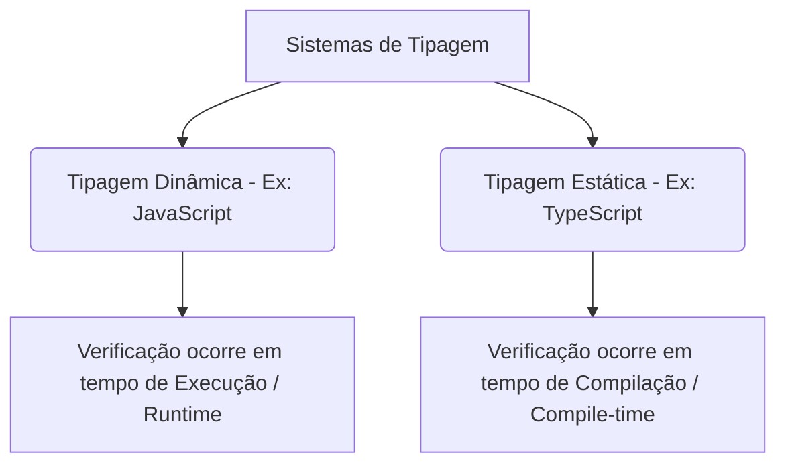

# Verificação de Tipo Estático

Nesta aula, vamos nos aprofundar no conceito que é o verdadeiro coração do TypeScript: a **Verificação de Tipo Estático** (Static Type Checking). Você entenderá como o TypeScript analisa o seu código enquanto você digita e como isso evita que erros bobos e falhas graves cheguem até o usuário final.

---

## O que é Verificação de Tipos?

Tipagem refere-se às regras de como uma linguagem de programação trata os diferentes tipos de dados (números, textos, objetos, etc.). Existem duas abordagens principais para verificar se essas regras estão sendo seguidas:



### 1. Tipagem Dinâmica (JavaScript)
No JavaScript puro, a verificação de tipos acontece em **tempo de execução** (Runtime). O interpretador só sabe qual é o tipo de uma variável quando chega a linha de código em que ela é executada.
* **Problema**: Se você cometer um erro de tipo dentro de uma condição `if` raramente acessada, esse erro só será descoberto quando um usuário cair nessa condição em produção.

### 2. Tipagem Estática (TypeScript)
No TypeScript, a verificação de tipos acontece em **tempo de compilação** (Compile-time). O TypeScript analisa o código-fonte estaticamente (ou seja, sem executá-lo), inspecionando a estrutura e as conexões do código para garantir que ele faça sentido lógico.
* **Solução**: Erros de tipo são encontrados imediatamente no editor ou durante o build, impedindo a geração do pacote final caso existam falhas.

---

## Tipagem Explícita vs Inferência de Tipos

Uma dúvida muito comum para quem está começando é: *"Preciso declarar o tipo de absolutamente tudo no TypeScript?"* 

A resposta é **não**. O TypeScript possui um mecanismo inteligente chamado **Inferência de Tipos**.

### Inferência de Tipos (Tipagem Implícita)
O TypeScript é inteligente o suficiente para deduzir o tipo de uma variável com base no valor atribuído a ela.

```typescript
let nome = "João"; // O TypeScript infere automaticamente que 'nome' é do tipo 'string'

nome = 42; 
// Erro: Type 'number' is not assignable to type 'string'.
```
Você não precisou escrever `: string`, mas o TypeScript já protegeu a variável contra reatribuições de tipos incompatíveis.

### Tipagem Explícita
A tipagem explícita é quando declaramos manualmente o tipo de uma variável, parâmetro de função ou retorno.

```typescript
let idade: number = 25; // Declarando explicitamente como number

function saudar(nome: string): string {
  return `Olá, ${nome}!`;
}
```

> [!TIP]
> **Qual usar?**
> Deixe o TypeScript inferir os tipos sempre que possível (declaração de variáveis simples, constantes, etc.) para manter o código limpo. Use tipagem explícita em parâmetros de funções, retornos complexos ou quando inicializar uma variável sem valor inicial.

---

## Tipos Primitivos do TypeScript

O TypeScript suporta todos os tipos primitivos do JavaScript. Ao tipar variáveis de forma estática, você utilizará principalmente:

* **`string`**: Textos (`"Olá"`, `'Mundo'`, `` `Template Literais` ``).
* **`number`**: Números inteiros e de ponto flutuante (`42`, `3.14`).
* **`boolean`**: Valores lógicos (`true`, `false`).
* **`null`**: Ausência intencional de valor.
* **`undefined`**: Variáveis não inicializadas.
* **`symbol`**: Valores únicos e imutáveis.

Exemplo de uso:
```typescript
const ativo: boolean = true;
const total: number = 150.50;
const usuario: string = "Ana";
```

---

## Erros Comuns Evitados pela Verificação Estática

Graças à checagem estática de tipos, o TypeScript consegue apontar no seu editor diversos problemas antes de você abrir o navegador ou rodar o Node:

### 1. Erros de Digitação (Typo Protection)
Se você tentar acessar uma propriedade que não existe em um objeto ou cometeu um erro ortográfico, o TypeScript avisa imediatamente.

```typescript
const usuario = {
  nome: "Lucas",
  email: "lucas@email.com"
};

console.log(usuario.emaiil); 
// Erro: Property 'emaiil' does not exist on type '{ nome: string; email: string; }'. Did you mean 'email'?
```

### 2. Chamadas de Função Incorretas
Chamar funções com número incorreto de argumentos ou tipos incompatíveis é proibido.

```typescript
function enviarEmail(destinatario: string, assunto: string) {
  // lógica de envio...
}

enviarEmail("admin@email.com"); 
// Erro: Expected 2 arguments, but got 1.
```

### 3. Operações Inválidas entre Tipos Diferentes
Evita operações sem sentido lógico que no JavaScript resultariam em `NaN` ou comportamentos inesperados.

```typescript
const valor = "100";
const resultado = valor - 10; 
// Erro: The right-hand side of an arithmetic operation must be of type 'any', 'number', 'bigint' or an enum type.
```

---

## Resumo

A **verificação de tipo estático** funciona como uma rede de segurança de alta precisão para o desenvolvedor. Ela:
1. Analisa seu código **sem executá-lo**.
2. **Infere** tipos de forma inteligente, evitando código verboso.
3. Garante que as **interfaces e contratos** estabelecidos em seu código sejam respeitados em todo o projeto.
