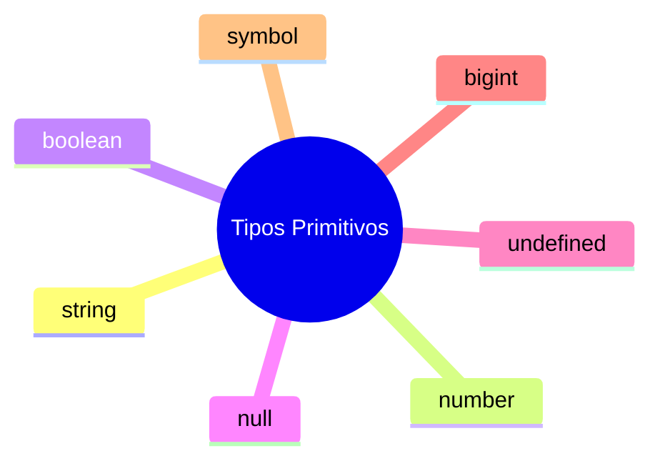

# Tipos Primitivos no TypeScript

Nesta aula, vamos estudar detalhadamente os **tipos primitivos** no TypeScript. Como o TypeScript é um superconjunto do JavaScript, ele herda diretamente os tipos primitivos da especificação ECMAScript, adicionando a checagem estática sobre eles.

---

## O que são Tipos Primitivos?

Os tipos primitivos são os blocos de construção mais básicos de dados em uma linguagem. Eles representam valores únicos e imutáveis (ou seja, o valor em si não pode ser alterado, apenas reatribuído).

O TypeScript possui **7 tipos primitivos principais**:



---

## Detalhando cada Tipo Primitivo

### 1. string
Representa sequências de caracteres (textos). Pode ser declarada usando aspas duplas (`"`), aspas simples (`'`) ou crases para template strings (`` ` ``).

```typescript
let nome: string = "Tayron";
let sobrenome: string = 'Rocha';
let apresentacao: string = `Olá, meu nome é ${nome} ${sobrenome}.`;
```

### 2. number
Diferente de outras linguagens que separam inteiros (`int`) de decimais (`float`/`double`), o JavaScript e o TypeScript tratam todos os números como `number`. Isso inclui inteiros, decimais, negativos e valores numéricos especiais como `NaN` e `Infinity`.

Também suporta diferentes bases numéricas (decimal, hexadecimal, octal e binária):

```typescript
let idade: number = 28;
let altura: number = 1.75;
let temperatura: number = -4;

let hex: number = 0xf00d;     // Hexadecimal
let binario: number = 0b1010; // Binário
```

### 3. boolean
Representa um valor lógico de verdadeiro (`true`) ou falso (`false`).

```typescript
let estaLogado: boolean = true;
let temAcesso: boolean = false;
```

### 4. bigint
Usado para armazenar números inteiros arbitrariamente grandes, que ultrapassam o limite seguro do tipo `number` (que é de $2^{53} - 1$).
Para definir um `bigint`, adiciona-se o sufixo `n` ao final do número.

> [!WARNING]
> O tipo `bigint` só está disponível se o seu projeto estiver configurado para compilar para versões modernas do JavaScript (ES2020 ou superior). Não é possível misturar operações diretamente entre `number` e `bigint` sem realizar conversões.

```typescript
let numeroGigante: bigint = 9007199254740991n;
let outroGigante: bigint = BigInt(9007199254740991);
```

### 5. symbol
Representa uma referência única e imutável, muito utilizada para criar identificadores únicos para propriedades de objetos, evitando colisões de nomes.

```typescript
const chaveUnica: symbol = Symbol("descricao");
const outraChave: symbol = Symbol("descricao");

console.log(chaveUnica === outraChave); // false (são garantidos como únicos)
```

### 6 e 7. null e undefined
Ambos servem para representar a ausência de valor, mas possuem semânticas ligeiramente diferentes:
* **`undefined`**: Indica que uma variável foi declarada, mas ainda não teve nenhum valor atribuído a ela (é o padrão do JavaScript).
* **`null`**: Indica uma ausência intencional de valor (uma variável que foi explicitamente limpa ou definida como vazia).

```typescript
let semDefinicao: undefined = undefined;
let valorVazio: null = null;
```

---

## Importante: `strictNullChecks`

Por padrão, `null` e `undefined` podem ser atribuídos a qualquer outro tipo (por exemplo, você poderia atribuir `null` a uma variável do tipo `string`). No entanto, isso costuma causar erros clássicos de runtime.

Para evitar isso, é altamente recomendado manter a flag `strictNullChecks` ativada no seu arquivo `tsconfig.json` (ela já vem ativada por padrão na configuração `strict: true`).

```json
{
  "compilerOptions": {
    "strictNullChecks": true
  }
}
```
Com essa flag ativada:
```typescript
let usuario: string = "Ana";
usuario = null; // Erro: Type 'null' is not assignable to type 'string'.
```

---

## Evite a armadilha dos wrappers: `string` vs `String`

No TypeScript, você pode notar que existem os tipos `string` (minúsculo) e `String` (maiúsculo). **Eles não são a mesma coisa.**

* **`string` (minúsculo)**: É o tipo primitivo puro. É este que você deve usar **sempre**.
* **`String` (maiúsculo)**: Refere-se ao objeto construtor/wrapper do JavaScript.

```typescript
// ERRADO: Evite usar wrappers como tipo
let nomeIncorreto: String = new String("Tayron");

// CORRETO: Use sempre o primitivo puro
let nomeCorreto: string = "Tayron";
```
O uso de tipos com letras maiúsculas (`String`, `Number`, `Boolean`) quase nunca é necessário e é considerado uma má prática no TypeScript.
