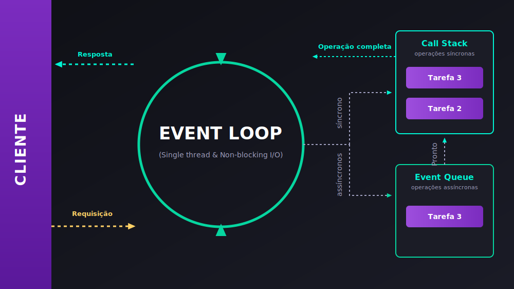

# 1 - Introdução ao Node.js

## O que é Node.js?

Node.js é um **ambiente de execução de JavaScript do lado do servidor (server-side)**. Em termos simples, ele permite que você execute código JavaScript fora de um navegador.

Até o surgimento do Node.js, o JavaScript era usado quase exclusivamente no front-end (nos navegadores) para manipular páginas web. O Node.js abriu a possibilidade de usar a mesma linguagem para o desenvolvimento do back-end, permitindo a criação de servidores, APIs, ferramentas de linha de comando e muito mais.

## Por que usar Node.js?

- **Linguagem Unificada:** Você pode usar JavaScript tanto no front-end quanto no back-end, o que simplifica o desenvolvimento (Full Stack JavaScript).
- **Alto Desempenho:** É construído sobre o motor V8 do Google Chrome, que é extremamente rápido. Sua arquitetura orientada a eventos e não-bloqueante (non-blocking I/O) o torna ideal para aplicações que precisam lidar com muitas conexões simultâneas (como chats, APIs, etc.).
- **Ecossistema Gigante:** O **NPM (Node Package Manager)** é o maior registro de pacotes de software do mundo. Você pode encontrar bibliotecas prontas para quase qualquer tarefa que imaginar.

## JavaScript no Browser vs. no Node.js

Embora a linguagem seja a mesma, o ambiente é diferente.

| No Browser...                               | No Node.js...                                      |
| ------------------------------------------- | -------------------------------------------------- |
| Tem acesso ao objeto `window` e `document`. | **Não** tem acesso a `window` ou `document` (DOM). |
| O objeto global é o `window`.               | O objeto global é o `global` (ou `globalThis`).    |
| Usado para interagir com o usuário (DOM).   | Usado para interagir com o sistema operacional.    |
| Lida com eventos do DOM (cliques, etc.).    | Tem acesso a APIs do sistema (arquivos, rede, etc.). |

---

## Quando usar e quando NÃO usar o Node.js?

Devido à sua arquitetura Single-Thread baseada em I/O não-bloqueante, o Node.js é extremamente otimizado para alguns cenários de back-end, mas apresenta limitações graves em outros.

### 🟢 Cenários Ideais (I/O-Bound)
Aplicações que passam a maior parte do tempo esperando por entrada/saída (I/O), como operações de rede, disco ou banco de dados:
* **APIs REST e GraphQL:** Comunicação rápida e frequente com bancos de dados e serviços externos.
* **Aplicações em Tempo Real (Real-time):** Chats, jogos online e aplicações de colaboração (usando WebSockets).
* **Streaming de Dados:** Transmissão de vídeo ou áudio (como Netflix, Spotify).
* **BFF (Backend For Frontend):** APIs intermediárias que apenas agregam dados de outros microsserviços para o frontend.

### 🔴 Cenários Não Recomendados (CPU-Bound)
Aplicações que exigem processamento intenso de CPU, cálculos matemáticos complexos ou manipulação de arquivos pesados:
* **Processamento de imagem e vídeo:** Compressão ou edição de mídia diretamente no backend.
* **Criptografia massiva:** Mineração de criptomoedas ou compressão pesada de arquivos (como ZIP).
* **Machine Learning e I.A.:** Treinamento de modelos ou processamento massivo de dados.

**Por que o Node.js é ruim em tarefas CPU-Bound?**
Como o JavaScript roda em uma única thread, se você iniciar um cálculo matemático extremamente pesado (CPU-bound), essa thread principal ficará **ocupada/travada** processando essa tarefa. Durante esse tempo, o Event Loop não conseguirá processar nenhuma outra requisição, travando o servidor para todos os outros usuários conectados na mesma aplicação!

---

## A Arquitetura: Single-Thread e I/O Não-Bloqueante

Para entender o poder do Node.js, precisamos compreender a sua arquitetura baseada em **Single-Thread**, **Call Stack** e **I/O Não-Bloqueante (Non-Blocking I/O)** controlado pelo **Event Loop**.

Para facilitar, vamos utilizar a **Analogia da Cafeteria** (exatamente como nos slides da nossa aula):

---

### ☕ A Analogia da Cafeteria

Imagine o funcionamento de uma cafeteria eficiente:



#### 1. O Barista e os Pedidos (A Call Stack)
Imagine que o barista tem uma **lista de tarefas** para cada pedido.
* Cada vez que o barista pega um pedido, ele o coloca no topo da lista e começa a trabalhar nele.
* Quando ele termina uma tarefa, ele a risca da lista e pega a próxima tarefa do topo.
* A **Call Stack (Pilha de Chamadas)** é exatamente como essa lista. Cada função que precisa ser executada pelo JavaScript é colocada no topo da pilha (stack). O Node.js executa a função que está no topo e, quando ela termina, a remove da pilha e passa para a próxima.

#### 2. O Forno e as Tarefas Demoradas (I/O Não-Bloqueante)
Se o barista precisasse assar um bolo, ele não ficaria parado na frente do forno por 40 minutos esperando o bolo assar sem atender mais ninguém.
* O barista simplesmente coloca o bolo no forno (delega a tarefa lenta) e volta imediatamente a atender os clientes na fila.
* No Node.js, tarefas pesadas (como ler arquivos do disco ou consultar o banco de dados) são delegadas para o sistema operacional ou para threads de segundo plano (gerenciadas pela biblioteca **libuv** em C++ por baixo do capô). A thread principal (o barista) fica livre na hora.

#### 3. O Organizador (O Event Loop)
Além do barista, a cafeteria tem um **organizador** que monitora a lista de tarefas do barista.
* Quando o barista está ocupado, o organizador fica atento às tarefas que estão terminando em paralelo (como o bolo que acabou de assar). Assim que o bolo fica pronto, ele entra na **Fila de Eventos (Event Queue)**.
* Se a **Call Stack** (lista de tarefas do barista) estiver vazia, o organizador (Event Loop) pega a tarefa concluída da fila de eventos e a coloca na Call Stack do barista para que ele faça a entrega ao cliente.

---

### 🔄 O Fluxo de Execução no Diagrama (Passo a Passo)

Acompanhando as linhas tracejadas do diagrama, o ciclo de vida de uma operação no Node.js segue o seguinte fluxo:

1. **Requisição (Entrada):** O **Cliente** faz uma requisição que entra no **Event Loop**.
2. **Triagem pelo Event Loop:**
   * **Operações Síncronas (síncrono):** São enviadas diretamente para a **Call Stack** (Pilha) e executadas imediatamente pelo JavaScript.
   * **Operações Assíncronas (assíncronos):** Se envolverem I/O pesado (banco de dados, arquivos, requisições de rede), elas são enviadas para segundo plano, sendo processadas pelas threads da **libuv** ou pelo próprio sistema operacional.
3. **Operação Completa (Background):** Enquanto o background processa a tarefa pesada, o **Event Loop** continua livre atendendo outras requisições. Assim que a tarefa termina, ela é enviada como uma **Operação completa** para a **Event Queue** (Fila de Eventos).
4. **Retorno para a Pilha (Pronto):** O **Event Loop** monitora a **Call Stack**. Quando a pilha fica vazia (sem tarefas síncronas para processar), ele move a tarefa que está na **Event Queue** para a **Call Stack** (sinalizado como **Pronto** no diagrama).
5. **Resposta (Saída):** A tarefa é executada na Call Stack e a **Resposta** final é enviada de volta ao **Cliente**.

> [!TIP]
> Para rever o funcionamento técnico detalhado de filas e pilhas no JavaScript, acesse a aula de [6 - Conhecendo o Event Loop](file:///Users/tayron/Documents/github/FullStack-JS-Notes/3.1%20-%20JavaScript%20Antes%20do%20Framework/3.1.5%20-%20Fun%C3%A7%C3%B5es%20Ass%C3%ADncronas/6%20-%20Conhecendo%20o%20Event%20Loop.md).

---

## Executando seu Primeiro Script

1.  **Crie um arquivo:** Crie um arquivo chamado `app.js`.

2.  **Escreva o código:** Adicione o seguinte código ao arquivo.

    ```javascript
    // app.js
    const saudacao = "Olá, Mundo a partir do Node.js!";
    console.log(saudacao);
    ```

3.  **Execute no terminal:** Abra seu terminal, navegue até a pasta onde você salvou o arquivo e execute o seguinte comando:

    ```bash
    node app.js
    ```

4.  **Resultado:** Você verá a mensagem `Olá, Mundo a partir do Node.js!` impressa no seu terminal.

Parabéns, você executou seu primeiro código JavaScript no back-end com Node.js!

---

## 🚀 Indo Mais Fundo (Leituras Recomendadas)

Se você deseja se aprofundar nos detalhes de baixo nível e na arquitetura interna do Node.js, confira as seguintes referências:

### Links Internos (Revisão de Fundamentos)
* **[6 - Conhecendo o Event Loop (JS)](file:///Users/tayron/Documents/github/FullStack-JS-Notes/3.1%20-%20JavaScript%20Antes%20do%20Framework/3.1.5%20-%20Fun%C3%A7%C3%B5es%20Ass%C3%ADncronas/6%20-%20Conhecendo%20o%20Event%20Loop.md):** Entenda como funciona a Call Stack, Task Queue e Microtask Queue no motor JavaScript.
* **[7 - Prioridade e ordem de execução (JS)](file:///Users/tayron/Documents/github/FullStack-JS-Notes/3.1%20-%20JavaScript%20Antes%20do%20Framework/3.1.5%20-%20Fun%C3%A7%C3%B5es%20Ass%C3%ADncronas/7%20-%20Prioridade%20e%20ordem%20de%20execu%C3%A7%C3%A3o.md):** Veja na prática como o compilador decide qual código assíncrono executa primeiro.

### Documentações Oficiais (Arquitetura)
* **[Guia Oficial: O Event Loop do Node.js](https://nodejs.org/pt-br/learn/asynchronous-work/event-loop-timers-and-nexttick):** O artigo oficial explicativo de como o loop de eventos funciona, abordando fases específicas (timers, pending callbacks, poll, check e close).
* **[Entendendo I/O Bloqueante vs Não-Bloqueante](https://nodejs.org/pt-br/learn/asynchronous-work/blocking-vs-non-blocking):** A documentação oficial detalhando a diferença de comportamento entre métodos síncronos e assíncronos no Node.js.
* **[libuv - Site Oficial](https://libuv.org/):** Documentação oficial da biblioteca multiplataforma escrita em C que gerencia a thread pool, loops de eventos assíncronos e I/O de arquivos/rede no Node.
* **[O Motor V8](https://v8.dev/):** O site oficial do motor open-source de JavaScript e WebAssembly do Google Chrome usado pelo Node.js para compilar JS em código de máquina.
* **[Don't Block the Event Loop!](https://nodejs.org/en/learn/asynchronous-work/dont-block-the-event-loop):** Artigo oficial avançado que explica detalhadamente como escrever código de alta performance no Node sem travar o processador do servidor.

