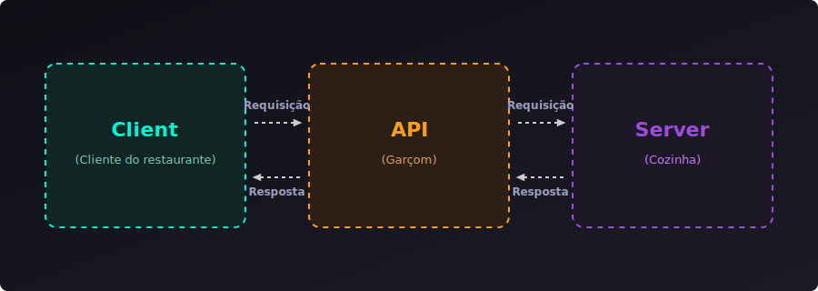

# 1 - O que é uma API?

No desenvolvimento de software moderno, raramente uma aplicação funciona de forma isolada. Sites precisam buscar produtos em bancos de dados, aplicativos de celular precisam autenticar usuários e sistemas de pagamento precisam se comunicar com bancos. 

A ferramenta que torna todas essas conexões possíveis é a **API**.

---

## 1. O que significa API?

**API** é a sigla para **Application Programming Interface** (Interface de Programação de Aplicação). 

Em termos simples, uma API é um **contrato de comunicação** entre dois sistemas de software. Ela define um conjunto de regras, padrões e caminhos para que uma aplicação possa solicitar recursos, dados ou serviços de outra, de forma segura e padronizada.

---

## 2. A Analogia do Restaurante 🍽️

A forma mais fácil e didática de entender o papel de uma API é imaginando um restaurante:



### 🔄 Como o fluxo funciona (Passo a Passo)

Observando as setas do diagrama, o ciclo de comunicação ocorre em 4 passos bem definidos:

1. **Passo 1 (Requisição do Cliente):** O **Client** (Cliente do restaurante / Frontend) inicia a ação enviando uma **Requisição** (pedido) para a **API** (Garçom).
2. **Passo 2 (Encaminhamento):** A **API** recebe o pedido, valida as informações e o repassa (envia uma nova **Requisição**) para o **Server** (Cozinha / Backend).
3. **Passo 3 (Processamento e Resposta do Servidor):** O **Server** recebe a solicitação, realiza as ações necessárias (busca dados no banco, executa cálculos, etc.) e envia a **Resposta** (prato pronto) de volta para a **API**.
4. **Passo 4 (Entrega Final):** A **API** recebe a resposta do servidor e a entrega (envia a **Resposta** final em formato como JSON) para o **Client** que a solicitou.

> [!NOTE]
> **O poder da abstração:**
> Como cliente do restaurante, você não precisa saber quais panelas a cozinha usa ou como o cozinheiro prepara os pratos. Você só precisa interagir com o garçom seguindo as opções do menu. 
> No desenvolvimento, o **Client** (aplicativo) não precisa saber qual linguagem ou banco de dados o **Server** utiliza por baixo dos panos; ele só precisa saber como fazer a requisição para a **API**.

---

## 3. O Ciclo de Comunicação (Cliente-Servidor)

A comunicação baseada em APIs segue o modelo **Cliente-Servidor** através de um ciclo de **Requisição (Request)** e **Resposta (Response)**:

```
[ Cliente ]  --- Envia uma REQUISIÇÃO (ex: buscar usuário "tayron") --->  [ API / Servidor ]
[ Cliente ]  <--- Devolve uma RESPOSTA (ex: dados do usuário em JSON) ---  [ API / Servidor ]
```

* **Cliente:** É quem solicita a informação (pode ser o navegador do seu computador, um aplicativo de celular, ou até outro servidor).
* **Servidor (onde roda a API):** É o sistema que recebe a requisição, processa os dados (conversando com o banco de dados se necessário) e devolve a resposta.

---

## 4. Formatos de Dados Comuns

Para que sistemas escritos em linguagens diferentes se entendam (por exemplo, um frontend em JavaScript se comunicando com um backend em Python), as APIs utilizam formatos de dados universais. O padrão mais utilizado hoje é o **JSON**:

### JSON (JavaScript Object Notation)
É um formato de texto leve, fácil de ler por humanos e de processar por máquinas:

```json
{
  "id": 1020,
  "nome": "Tayron Rocha",
  "email": "tayron@email.com",
  "ativo": true
}
```

---

## 5. Tipos de APIs (Arquiteturas)

Existem diferentes padrões de design e arquiteturas para construir APIs. As mais famosas são:

* **REST (Representational State Transfer):** É o padrão mais popular da web. Utiliza o protocolo HTTP e seus verbos (GET, POST, PUT, DELETE) e responde principalmente em formato JSON.
* **GraphQL:** Uma tecnologia mais recente que permite ao cliente solicitar especificamente apenas os dados de que precisa, evitando transferir dados desnecessários.
* **gRPC:** Desenvolvido pelo Google, é focado em alta performance e comunicação extremamente rápida entre microsserviços (backend para backend), usando arquivos binários em vez de texto.
* **SOAP:** Um padrão mais antigo e rígido baseado em XML, ainda muito comum em sistemas bancários e governamentais legados devido a rígidos padrões de segurança.

---

## 6. Por que usamos APIs? (Vantagens)

1. **Desacoplamento (Divisão de Responsabilidades):** O time de Frontend pode focar na interface do usuário (HTML/CSS/React) enquanto o time de Backend foca nas regras de negócio e banco de dados.
2. **Reutilização de Código:** O mesmo backend (a mesma API) pode alimentar o site web, o aplicativo de Android, o aplicativo de iOS e integrar com sistemas parceiros.
3. **Segurança:** O cliente nunca acessa o banco de dados diretamente. A API atua como uma barreira de segurança, validando quem está pedindo o dado e se essa pessoa tem autorização para acessá-lo.
4. **Integração entre Sistemas:** Permite usar serviços de terceiros sem criar tudo do zero. Exemplos: integrar pagamentos via Stripe/PayPal, mostrar um mapa do Google Maps ou buscar a previsão do tempo de um serviço de meteorologia.
