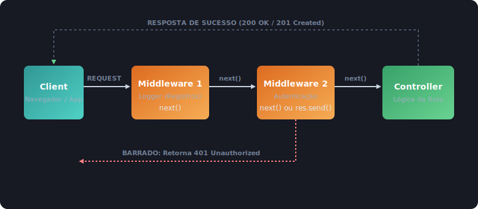

# 10 - Conceito de Middleware

No desenvolvimento de APIs com Node.js (especialmente ao usar frameworks como o Express e Next.js), o termo **Middleware** é um dos conceitos mais importantes que você encontrará. 

Entender middlewares é a chave para estruturar códigos limpos, seguros, modulares e de fácil manutenção.

---

## 1. O que é um Middleware?

Um **Middleware** (que significa *"o que está no meio"*) é simplesmente uma função que é executada no meio do ciclo de **Requisição (Request)** e **Resposta (Response)** de um servidor.

Ele fica "escutando" as requisições que chegam, realiza alguma tarefa (como validação, logs ou autenticação) e decide se a requisição pode continuar para o próximo passo ou se deve ser interrompida imediatamente.



### O que um middleware pode fazer?
1. Executar qualquer tipo de código JavaScript.
2. Modificar os objetos `request` e `response` (adicionando novas propriedades).
3. Finalizar o ciclo de requisição e resposta (enviando uma resposta direta ao cliente, como um erro `401 Unauthorized`).
4. Chamar a próxima função middleware na pilha (utilizando a função `next()`).

---

## 2. A anatomia de um Middleware no Express.js

No Express, uma função de middleware recebe três parâmetros principais:
* `req` (objeto da requisição)
* `res` (objeto da resposta)
* `next` (função que indica ao Express para passar para o próximo middleware da lista)

```javascript
function meuMiddleware(req, res, next) {
  // 1. Faz alguma lógica...
  console.log("Passou pelo middleware!");

  // 2. Chama a próxima função
  next(); 
}
```

> [!CAUTION]
> Se você esquecer de chamar a função `next()` e não finalizar a resposta com um `res.end()` ou `res.send()`, a requisição do cliente ficará "travada" (carregando infinitamente) até estourar o tempo limite (*timeout*).

---

## 3. Exemplos Práticos de Middlewares

### A. Middleware de Log (Apenas registra informações no console)
Registra o método HTTP e a URL de todas as requisições que chegam ao servidor.

```javascript
import express from 'express';
const app = express();

// Middleware de log
app.use((req, res, next) => {
  const hora = new Date().toISOString();
  console.log(`[${hora}] ${req.method} para a rota ${req.url}`);
  next(); // Passa para a rota desejada
});

app.get('/users', (req, res) => {
  res.json({ mensagem: "Lista de usuários" });
});
```

### B. Middleware de Autenticação (Bloqueia ou permite acesso)
Verifica se um cabeçalho de autorização existe. Se não existir, retorna um erro `401 Unauthorized` e interrompe o fluxo (não chama `next()`).

```javascript
function verificarAutenticacao(req, res, next) {
  const authHeader = req.headers.authorization;

  if (!authHeader) {
    // Interrompe o fluxo e responde ao cliente
    return res.status(401).json({ erro: "Token de autenticação não fornecido." });
  }

  // Se tudo estiver certo, prossegue para a rota
  next();
}

// Aplicando o middleware apenas na rota protegida
app.get('/admin/painel', verificarAutenticacao, (req, res) => {
  res.json({ mensagem: "Bem-vindo ao painel administrativo secreto!" });
});
```

---

## 4. Tipos de Middlewares no Express

Podemos classificar os middlewares em quatro categorias principais no dia a dia:

1. **Middlewares Globais (Application-level)**: Aplicados a todas as rotas da aplicação usando `app.use()`.
   ```javascript
   app.use(express.json()); // Middleware em nível de aplicação
   ```
2. **Middlewares de Rota (Router-level)**: Vinculados a uma rota específica ou grupo de rotas.
   ```javascript
   app.post('/products', verificarAutenticacao, criarProdutoHandler);
   ```
3. **Middlewares de Terceiros**: Pacotes externos instalados via gerenciador de pacotes para resolver problemas comuns (ex: `cors`, `morgan`).
4. **Middlewares de Tratamento de Erros**: Têm quatro argumentos `(err, req, res, next)` para interceptar falhas globais.

---

## 5. Middleware vs Proxy no Next.js (Edge Runtime)

No ecossistema do **Next.js**, o conceito de middleware ganhou uma particularidade importante: ele roda no **Edge Runtime** (um ambiente baseado na V8 Engine do Chrome, sem todo o ecossistema do Node.js nativo). Isso garante que o middleware execute de forma extremamente rápida, mas impõe limitações.

### 5.1. Limitações do Middleware no Next.js:
* Não possui acesso a módulos nativos do Node (como `fs`, `path`, `crypto`).
* Não permite pacotes NPM muito pesados ou com dependências binárias complexas.
* Possui limites rígidos de tempo de execução e tamanho de código.

### 5.2. A Transição para Proxy
Quando tentamos usar o Middleware do Next.js para fazer encaminhamento complexo de chamadas, reescrita pesada de respostas ou repassar requisições com dados volumosos (Streaming / Uploads) para um backend externo, podemos esbarrar nas limitações do Edge Runtime. Nesse cenário, o recomendado é utilizar um **Proxy**.

#### Formas de implementar Proxy no Next.js:
1. **Declarativa via `next.config.js` (Rewrites)**: Excelente para mascarar URLs e redirecionar tráfego para APIs externas sem código customizado:
   ```javascript
   // next.config.js
   module.exports = {
     async rewrites() {
       return [
         {
           source: '/api/backend/:path*',
           destination: 'https://api.meubackend.com/:path*', // Proxy nativo e otimizado
         },
       ]
     },
   }
   ```
2. **API Routes (Node.js Runtime)**: Criar uma rota sob `/pages/api/` ou `/app/api/` usando bibliotecas como `http-proxy` ou `http-proxy-middleware`. Como as API Routes rodam sobre o Node.js comum, não há restrições de bibliotecas ou consumo de recursos Edge.

---

## 6. Boas Práticas de Uso

### Boas Práticas para Middlewares:
* **Mantenha-os leves**: Middlewares executam em todas as requisições (ou no grupo selecionado). Evite tarefas assíncronas pesadas, consultas complexas ao banco de dados ou loops intensivos.
* **Defina Escopo (Match/Matcher)**: No Next.js, utilize a configuração de `matcher` para evitar que o middleware seja executado para arquivos estáticos, imagens e rotas que não necessitam dele:
   ```javascript
   export const config = {
     matcher: ['/dashboard/:path*', '/api/:path*'], // Roda apenas onde é necessário
   }
   ```
* **Não esqueça o fluxo**: Sempre termine o middleware com `next()` ou respondendo a requisição diretamente (ex: `return res.status(400).end()`).

### Boas Práticas para Proxies:
* **Gerencie Cabeçalhos Corretamente**: Certifique-se de encaminhar cabeçalhos essenciais de IP do cliente (como `X-Forwarded-For`, `X-Real-IP`) para que o seu servidor backend saiba a origem real da requisição.
* **Trate Timeouts**: Adicione limites de tempo para as requisições proxyadas a fim de evitar que falhas no backend secundário derrubem a sua aplicação Next.js por estouro de conexões em espera.
* **Cache em APIs Públicas**: Se estiver proxyando requisições de leitura de APIs externas, adicione cabeçalhos de Cache (`Cache-Control`) para reduzir a carga sobre o seu servidor de destino.

---

## 7. Como Middleware se parece no Node.js Nativo?

Embora o Express e o Next.js utilizem um sistema de gerenciamento de middlewares robusto por baixo dos panos, no Node.js nativo criamos um padrão parecido de forma manual, chamando funções em sequência. 

A função `jsonBodyParser` que criamos na aula anterior agiu exatamente como um middleware: interceptando a requisição, processando o fluxo de dados (streams), modificando o objeto `request` anexando `request.body` e permitindo que as rotas subsequentes leiam o resultado.
