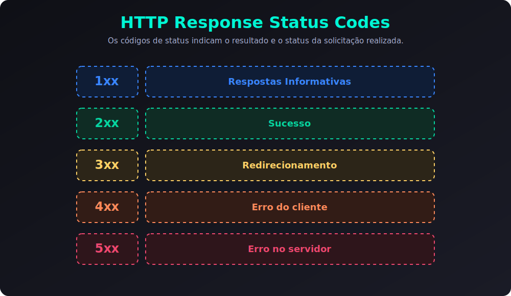

# 4 - Métodos HTTP (Verbos)

O protocolo **HTTP** (Hypertext Transfer Protocol) é a base de comunicação de toda a Web. Quando um cliente (navegador, aplicativo mobile) se comunica com um servidor através de uma API, ele não envia apenas um endereço (URL), mas também indica qual **ação** deseja realizar sobre aquele recurso. 

Essas ações são definidas pelos **Métodos HTTP** (comumente chamados de **Verbos HTTP**). Nesta aula, estudaremos os principais métodos, suas funções em APIs REST e conceitos fundamentais como segurança e idempotência.


---

## 1. Os Métodos Principais (Mapeamento CRUD)

Em APIs estruturadas sob a arquitetura REST, cada operação do **CRUD** (Create, Read, Update, Delete) é representada por um método HTTP específico:

### 🟢 `GET` (Read - Ler)
* **Objetivo:** Solicitar a representação de um recurso do servidor. É usado puramente para recuperar informações.
* **Corpo (Body):** **Não** deve enviar dados no corpo (as informações de busca e filtros devem ir apenas na URL ou Query Params).
* **Exemplo:** `GET /produtos` (lista todos os produtos) ou `GET /produtos/15` (detalhes do produto 15).

> [!NOTE]
> **GET com Corpo (Body) é permitido?**
> Embora o protocolo HTTP não proíba explicitamente o envio de um corpo em requisições `GET`, a especificação (RFC 7231 / RFC 9110) deixa claro que a presença de um corpo em um `GET` não tem semântica definida. Na prática, muitos servidores, proxies, CDN's ou bibliotecas de cliente ignoram, barram ou removem o corpo de requisições `GET`. Por isso, **não é recomendado** usar corpo com `GET`. Para consultas muito grandes que ultrapassam o limite de caracteres da URL (cerca de 2.048 a 8.192 caracteres dependendo do cliente/servidor), historicamente utiliza-se o método `POST`, ou o novo método `QUERY` (descrito abaixo).

---

### 🟡 `POST` (Create - Criar)
* **Objetivo:** Enviar dados ao servidor para criar um novo recurso.
* **Corpo (Body):** **Sim**, envia as informações do novo recurso que será criado (geralmente em formato JSON).
* **Exemplo:** `POST /produtos` enviando no corpo `{ "nome": "Caneta", "preco": 2.50 }`.

---

### 🔵 `PUT` (Update - Substituir / Atualizar Total)
* **Objetivo:** Substituir completamente um recurso existente pelos novos dados enviados. Se o recurso não existir, em algumas implementações, ele pode ser criado.
* **Corpo (Body):** **Sim**, deve conter a representação completa e atualizada do recurso.
* **Exemplo:** `PUT /produtos/15` enviando `{ "nome": "Notebook Novo", "preco": 5000.00 }`.
> [!WARNING]
> Ao usar o `PUT`, se o recurso original possuir campos como `foto` ou `descricao` e você enviar apenas `nome` e `preco`, o comportamento esperado é que as propriedades omitidas sejam limpas ou definidas como nulas no servidor, pois o `PUT` faz uma **substituição total**.

---

### 🔴 `DELETE` (Delete - Excluir)
* **Objetivo:** Remover um recurso específico do servidor.
* **Corpo (Body):** **Não** envia corpo. O identificador do recurso que será removido vai diretamente na URL.
* **Exemplo:** `DELETE /produtos/15` (remove o produto de ID 15).

---

## 2. Métodos Adicionais Importantes

Além dos quatro verbos principais, existem outros métodos indispensáveis no desenvolvimento de APIs modernas:

### 🟠 `PATCH` (Update - Modificar / Atualizar Parcial)
* **Objetivo:** Realizar modificações parciais em um recurso existente. Ao contrário do `PUT` (que substitui tudo), o `PATCH` altera apenas os campos informados.
* **Corpo (Body):** **Sim**, contendo apenas as propriedades que devem ser alteradas.
* **Exemplo:** `PATCH /usuarios/8` enviando apenas `{ "ativo": false }` para desativar a conta do usuário, sem alterar seu nome, e-mail ou senha.

---

### ⚪ `OPTIONS`
* **Objetivo:** Solicitar informações sobre quais métodos e cabeçalhos de comunicação são permitidos para um determinado endpoint. É amplamente utilizado pelos navegadores para validações de segurança em conexões de origens diferentes (o mecanismo de **CORS**).

---

### ⚪ `HEAD`
* **Objetivo:** É idêntico ao `GET`, mas o servidor responde **apenas com os cabeçalhos (Headers)**, sem enviar o corpo da mensagem. É útil para checar se um recurso existe, verificar seu tamanho (Content-Length) ou data de modificação antes de fazer o download do arquivo completo.

---

### 🟣 `QUERY` (RFC 9435)
* **Objetivo:** Realizar consultas (queries) seguras e idempotentes de forma que os parâmetros e filtros de busca possam ser enviados no **corpo (body)** da requisição. Foi criado especificamente para resolver o problema de consultas extremamente longas ou complexas que excedem os limites práticos de tamanho da URL.
* **Corpo (Body):** **Sim**, envia os parâmetros da busca, filtros ou formato da resposta desejada no corpo da requisição.
* **Status:** Definido na RFC 9435 (publicada em 2024). Embora seja o padrão ideal para buscas complexas, verifique a compatibilidade do seu framework web/servidor, pois a adoção em ferramentas mais antigas ainda está em andamento.

---

## 3. Conceitos Cruciais: Seguro vs. Idempotente

Compreender estes dois conceitos teóricos de arquitetura HTTP separa desenvolvedores iniciantes de profissionais experientes:

### A. Métodos Seguros (Safe Methods)
Um método HTTP é considerado **seguro** se ele for puramente de **leitura** (read-only) e sua execução não alterar o estado dos dados no servidor (não cria, altera ou exclui registros).
* **Métodos seguros:** `GET`, `QUERY`, `HEAD`, `OPTIONS`.
* **Por que importa?** Ferramentas automatizadas, como indexadores de busca (Googlebot) ou web crawlers, podem acessar links desses métodos livremente sem o risco de realizar alterações indesejadas, como comprar um produto ou deletar uma conta.

---

### B. Métodos Idempotentes (Idempotent Methods)
Um método é **idempotente** se o resultado de realizar a mesma requisição múltiplas vezes de forma idêntica for **exatamente o mesmo** que realizá-la uma única vez. O estado do servidor não muda após a primeira execução bem-sucedida.

* **Idempotentes:** `GET`, `QUERY`, `PUT`, `DELETE`, `HEAD`, `OPTIONS`.
  * *Por que o PUT é idempotente?* Se você atualizar o preço do produto 10 para `150.00` dez vezes seguidas, no final das dez execuções o preço continuará sendo `150.00`.
  * *Por que o DELETE é idempotente?* Deletar o produto 10 a primeira vez o remove do banco. Tentar deletar as próximas nove vezes não alterará mais nada (ele continuará deletado, embora o servidor possa responder com status de erro 404 nas requisições seguintes).
* **NÃO Idempotentes:** `POST`, `PATCH`.
  * *Por que o POST NÃO é idempotente?* Se você enviar a requisição `POST /produtos` contendo `{ "nome": "Caneta" }` dez vezes seguidas, você criará dez registros duplicados de caneta no seu banco de dados.

---

## 4. Resumo Comparativo

| Método | Ação CRUD | Envia Body? | É Seguro? | É Idempotente? |
| :--- | :--- | :--- | :--- | :--- |
| **`GET`** | Ler (Read) | ❌ Não | ✅ Sim | ✅ Sim |
| **`QUERY`** | Ler/Consultar (Read) | ✅ Sim | ✅ Sim | ✅ Sim |
| **`POST`** | Criar (Create) | ✅ Sim | ❌ Não | ❌ Não |
| **`PUT`** | Atualizar total (Update) | ✅ Sim | ❌ Não | ✅ Sim |
| **`PATCH`** | Atualizar parcial (Update)| ✅ Sim | ❌ Não | ❌ Não |
| **`DELETE`**| Deletar (Delete) | ❌ Não | ❌ Não | ✅ Sim |

---

## 5. O que é o Timeout da Requisição?

No desenvolvimento de APIs e comunicações de rede, o **Timeout** (Tempo Limite) é o tempo máximo que um cliente ou um servidor concorda em esperar para que uma operação de rede seja concluída antes de desistir e encerrar a conexão.

Imagine que você fez um pedido no restaurante (analogia da API) e o garçom foi para a cozinha. Se a cozinha demorar 3 horas para preparar o prato, você não vai ficar esperando lá para sempre. Você vai embora. O **Timeout** é exatamente esse limite de paciência.

---

### A. Por que o Timeout é Importante?

1. **No lado do Cliente (Client-side):**
   * **Evita travamentos na interface:** Se a API travar por causa de uma consulta lenta no banco de dados, não queremos que o aplicativo do usuário fique com a tela de carregamento (loading) rodando infinitamente.
   * **Experiência do Usuário (UX):** Definimos um limite (ex: 5 segundos). Se o servidor não responder nesse tempo, a requisição é cancelada e mostramos uma mensagem amigável: *"Erro de conexão. Tente novamente mais tarde"*.

2. **No lado do Servidor (Server-side):**
   * **Proteção de Recursos:** Manter uma conexão aberta consome memória RAM e processamento do servidor. Se milhares de conexões lentas ficarem abertas simultaneamente sem responder, o servidor ficará sem recursos para novos usuários.
   * **Prevenção de Ataques (Slowloris):** Ataques do tipo DoS (Denial of Service) tentam derrubar servidores abrindo milhares de conexões e enviando dados extremamente devagar para mantê-las abertas. Ter limites de timeout baixos e bem configurados protege a aplicação desse tipo de ataque.

---

### B. Status Codes HTTP Associados a Timeout

Quando ocorre um problema de tempo limite, a API ou os servidores intermediários retornam códigos de status específicos:

* **`408 Request Timeout` (Erro do Cliente):**
  * O servidor encerrou a conexão porque o cliente demorou muito para enviar a requisição completa (ex: o cliente começou a enviar um arquivo muito pesado, mas a conexão dele caiu ou ficou lenta demais).
* **`504 Gateway Timeout` (Erro do Servidor):**
  * Ocorre quando há um servidor intermediário (como um Balanceador de Carga, Nginx ou Cloudflare) entre o cliente e o backend. O intermediário tentou se conectar com o servidor da sua API Node.js, mas o seu servidor demorou mais tempo para responder do que o limite aceitável do intermediário.

---

### C. Como Configurar na Prática (Exemplos)

#### 1. No Cliente (ex: usando a biblioteca Axios no Frontend)
```javascript
import axios from 'axios';

const api = axios.create({
  baseURL: 'https://api.meusite.com',
  timeout: 5000 // Define que a requisição deve falhar se o servidor demorar mais de 5 segundos (5000ms)
});
```

#### 2. No Servidor (Node.js nativo)
O Node.js possui timeouts padrão para conexões HTTP (como `requestTimeout` e `headersTimeout` que geralmente vêm configurados para 5 minutos por padrão). Em produção, é comum limitar isso para evitar conexões presas:
```javascript
import http from 'node:http';

const server = http.createServer((req, res) => {
  // lógica do servidor
});

// Limita o tempo de processamento de cada requisição para 30 segundos (30000ms)
server.requestTimeout = 30000; 
```

---

## 6. HTTP Response Status Codes (Códigos de Resposta)

Os **Códigos de Status de Resposta HTTP** (HTTP Response Status Codes) indicam o resultado de uma solicitação enviada ao servidor. Eles servem para que o cliente (navegador, aplicativo ou API client) saiba exatamente o que aconteceu com seu pedido (se foi concluído com sucesso, se houve algum erro de digitação/autorização ou se o servidor falhou).



---

### A. As 5 Famílias de Códigos HTTP

Os códigos de status são compostos por 3 dígitos e divididos em 5 categorias principais (representadas pelo primeiro dígito, de 1 a 5):

| Classe | Tipo | Descrição | Exemplo Comum |
| :--- | :--- | :--- | :--- |
| **`1xx`** | **Respostas Informativas** | O pedido foi recebido e o processo está continuando. | `101 Switching Protocols` |
| **`2xx`** | **Sucesso (Success)** | A ação foi recebida, compreendida e aceita com sucesso. | `200 OK`, `201 Created` |
| **`3xx`** | **Redirecionamento (Redirection)** | Mais ações precisam ser tomadas para concluir a requisição. | `301 Moved Permanently` |
| **`4xx`** | **Erro do Cliente (Client Error)** | A requisição contém sintaxe incorreta ou não pode ser processada por culpa do cliente. | `400 Bad Request`, `404 Not Found` |
| **`5xx`** | **Erro do Servidor (Server Error)** | O servidor falhou ao tentar processar uma requisição aparentemente válida. | `500 Internal Server Error` |

---

### B. Principais Códigos por Família

#### 🟢 2xx - Sucesso (Success)
Significa que tudo correu bem com a requisição do cliente.

* **`200 OK`**: A requisição foi bem-sucedida. O significado da resposta depende do método utilizado (no `GET` retorna o recurso; no `PUT`/`PATCH` confirma a alteração).
* **`201 Created`**: A requisição foi bem-sucedida e um **novo recurso foi criado** no servidor (muito comum em respostas de `POST`).
* **`204 No Content`**: A requisição foi bem-sucedida, mas **não há conteúdo** no corpo da resposta. É muito usado em requisições de `DELETE` (pois o recurso foi apagado e não há nada para retornar) ou em atualizações (`PUT`/`PATCH`) em que não se deseja devolver dados.

---

#### 🟡 3xx - Redirecionamento (Redirection)
Informa ao cliente que o recurso solicitado mudou de endereço ou que mais ações são necessárias para obtê-lo.

* **`301 Moved Permanently`**: O recurso solicitado mudou permanentemente para uma nova URL. O navegador redireciona automaticamente para o novo link.
* **`302 Found` (Redirecionamento temporário)**: O recurso mudou temporariamente de endereço.
* **`304 Not Modified`**: Usado para fins de **cache**. Indica que o recurso não mudou desde a última vez que foi solicitado. O cliente pode usar a cópia que já tem salva localmente, economizando internet e processamento.

---

#### 🟠 4xx - Erros do Cliente (Client Errors)
Esses códigos são retornados quando a API detecta que o problema está na requisição enviada pelo cliente.

* **`400 Bad Request`**: A requisição está mal formatada ou faltam dados obrigatórios (ex: enviar um JSON com sintaxe quebrada ou sem os campos requeridos).
* **`401 Unauthorized`**: O cliente precisa se **autenticar** (fazer login) para obter a resposta solicitada.
* **`403 Forbidden`**: O cliente está autenticado, mas **não possui permissão** para acessar aquele recurso específico (ex: um usuário comum tentando acessar uma rota administrativa `/admin`).
* **`404 Not Found`**: O recurso solicitado (URL ou ID do recurso) **não pôde ser encontrado** no servidor.
* **`408 Request Timeout`**: O servidor encerrou a conexão por tempo limite de espera (o cliente demorou muito para enviar os dados).
* **`409 Conflict`**: A requisição conflita com o estado atual do servidor (ex: tentar cadastrar um usuário com um e-mail que já existe no banco de dados).

---

#### 🔴 5xx - Erros do Servidor (Server Errors)
Significa que a requisição do cliente estava correta, mas o servidor da API encontrou uma falha interna ou está indisponível para processá-la.

* **`500 Internal Server Error`**: O erro "coringa" do servidor. Acontece quando ocorre um crash/erro não tratado no código do backend (ex: uma variável nula que estourou um erro ou uma falha de conexão interna).
* **`502 Bad Gateway`**: O servidor, ao agir como proxy ou gateway, recebeu uma resposta inválida do servidor de backend (upstream).
* **`503 Service Unavailable`**: O servidor está temporariamente indisponível (geralmente por sobrecarga ou manutenção programada).
* **`504 Gateway Timeout`**: O servidor intermediário (proxy/load balancer) não recebeu uma resposta a tempo do servidor principal onde roda a aplicação.

---

> [!TIP]
> **Boas Práticas na Escolha dos Status Codes:**
> No desenvolvimento de APIs REST, é fundamental retornar os códigos corretos. 
> * Nunca retorne `200 OK` contendo uma mensagem de erro no corpo do JSON (ex: `{ "error": "Usuário não encontrado" }`). Em vez disso, use `404 Not Found`.
> * Retornar códigos corretos facilita o tratamento de erros no Frontend e em integrações automatizadas.

