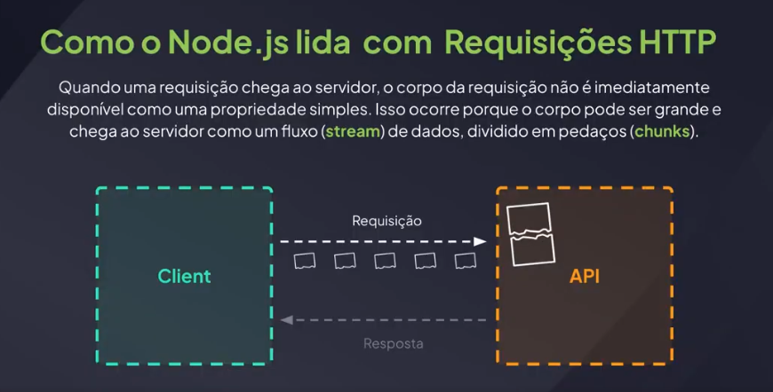
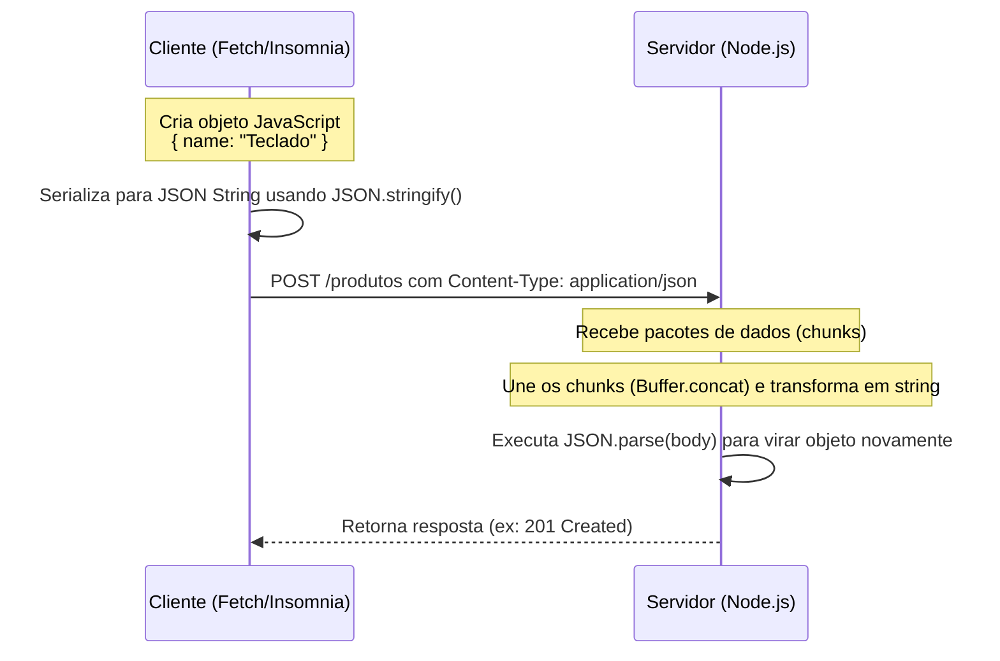

# 8 - Como o Node.js lida com requisições HTTP

Para entender profundamente o Node.js, é fundamental compreender como ele gerencia as requisições HTTP por debaixo dos panos. Diferente de servidores tradicionais (como o Apache), que criam uma nova thread (processo) para cada cliente, o Node.js usa uma arquitetura baseada em eventos, I/O não-bloqueante e streams.

---

## 1. Single Thread e Event Loop

O Node.js executa o JavaScript em uma única thread principal (Single-Threaded). Quando uma requisição HTTP chega ao servidor:
1. O Node.js **não** cria um novo processo/thread para atendê-la.
2. Em vez disso, ele delega a leitura da rede para o sistema operacional (I/O assíncrono).
3. O **Event Loop** monitora o término das operações de I/O. Quando os dados chegam, a função de callback associada (o seu handler no `createServer`) é colocada na fila e executada na thread principal.

Isso permite que o Node.js lide com milhares de conexões simultâneas com pouquíssimo consumo de memória.

---

## 2. Requisições como Streams e Chunks

Quando uma requisição chega ao servidor, o corpo da requisição não está imediatamente disponível como uma propriedade simples (como `request.body`). Isso ocorre porque o corpo pode ser grande (como uploads de imagens ou grandes volumes de texto) e chega ao servidor como um fluxo (**stream**) de dados, dividido em pedaços (**chunks**).

No Node.js, os objetos `request` e `response` na verdade são **Streams** (fluxos de dados):

* **`request` (Readable Stream)**: É um fluxo de dados de leitura. O corpo da requisição é transmitido da rede em pequenos pedaços (chunks em formato de `Buffer`) à medida que chegam.
* **`response` (Writable Stream)**: É um fluxo de escrita. Enviamos dados de resposta para a rede aos poucos usando `response.write()` e finalizamos a resposta chamando `response.end()`.

---

## 3. O Fluxo de Transmissão de Dados

Abaixo, podemos visualizar o ciclo de vida do envio e recebimento de dados estruturados em uma API Node.js nativa:

